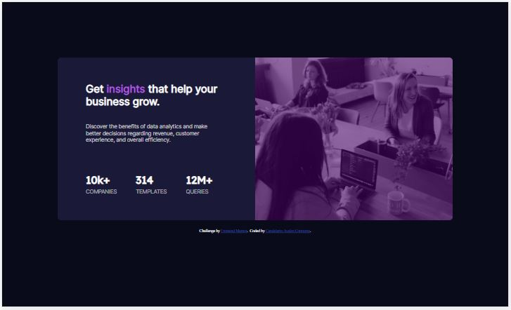

# Frontend Mentor - Stats preview card component solution

This is a solution to the [Stats preview card component challenge on Frontend Mentor](https://www.frontendmentor.io/challenges/stats-preview-card-component-8JqbgoU62). Frontend Mentor challenges help you improve your coding skills by building realistic projects. 

## Table of contents

- [Overview](#overview)
  - [The challenge](#the-challenge)
  - [Screenshots](#screenshot)
  - [Links](#links)
- [My process](#my-process)
  - [Built with](#built-with)
  - [What I learned](#what-i-learned)
  - [Continued development](#continued-development)
  - [Useful resources](#useful-resources)
- [Author](#author)


## Overview

### The challenge

Users should be able to:

- View the optimal layout depending on their device's screen size

### Screenshots





### Links

- Solution URL: [Add solution URL here](https://github.com/candelarioavalos/FEMentor01)
- Live Site URL: [Add live site URL here](https://candelarioavalos.github.io/FEMentor01/)

## My process

### Built with

- Semantic HTML5 markup
- CSS custom properties
- Flexbox
- Mobile-first workflow
- [Google fonts](https://fonts.google.com/)

### What I learned

First of all, I read all the guides and recomendations for this task and tried to follow them.

While I was thinking on how to add the fonts I had to use for this task, I started downloading the fonts, but then I thought that it was going to be loading folders in my computer and GitHub that I didn't need to, so, I decided then just to link the fonts with:

```html
<link href='https://fonts.googleapis.com/css?family=Inter' rel='stylesheet'>
```

I thought that it was a good idea to have one css file for general settings and one more for each different view that I was going to work with, so I wrote one css for general styles, one for mobile version and one more for desktop version, and it worked just great.
Also, I decided to set the break point for views to 1350 pixels, so, phone version for max-width: 1349px and desktop version for min-width: 1350px.

At first, I had some problem to set the appropriate image depending on the screen size view, but then I decided to use a picture element because it allows me to set the corresponding image for each screen size I set.

The rest for html was just think how to name id's and classes for the elements to style them with css.

While coding the general css stiles file, I decided to create and use variable names for colors, that way I could easily choose the corresponding colors for fonts, backgrounds, etc.

For margins and paddings, I had to resize the view of the design images to decide how many pixels I was going to set for each of this elements and how to set them in order to set the apropriate spaces acording to the design images.

The visual effect of the image, I thought that there was a special effect setting that I had to use, but then after playing a while with the transparency, I saw that I could fix that just by setting the apropriate backgroung color for the image, the problem here is still that I don't know the exact color for the image background, nor the settings for opacity, brightness etc. needed to get a better image visual effect. 


### Continued development

I found so interesting the fact that I could give a better visual effect to an image, that was my headache for a while, but after I learned how to work with it, I want to do that again in some of the next projects.

### Useful resources

- [w3schools.com](https://www.w3schools.com/) - This is the page where I have learned the most, they have a lot of easy to learn tutorials for web development and a lot of examples for every topic and language. I will keep studying at w3schools for a while, it is so exciting! Every time I need to see a code example, I search here first!

- [stackoverflow.com](https://stackoverflow.com/) - This is definitely a must while coding, I google everything I have a question abut all the time, and stackoverflow is always one of the options with the possible answer. For example, the image div was getting higher than the image itself, and it didn't look nice, I googled for a tip, and I found in stackoverflow that the best way to avoid that, was to set the display property for the image as block, and that really helped me fix that, I know it is smething easy and basic, but really a headache for a beginner!

## Author

- GitHub - [Candelario Avalos Contreras](https://github.com/candelarioavalos)
- Frontend Mentor - [Candelario Avalos Contreras](https://www.frontendmentor.io/profile/candelarioavalos)
- Facebook - [Candelario Avalos Contreras](https://www.facebook.com/candelario.avaloscontreras/)
- LinkedIn - [Candelario Avalos Contreras](https://www.linkedin.com/in/candelario-avalos-4a575b1b9/)